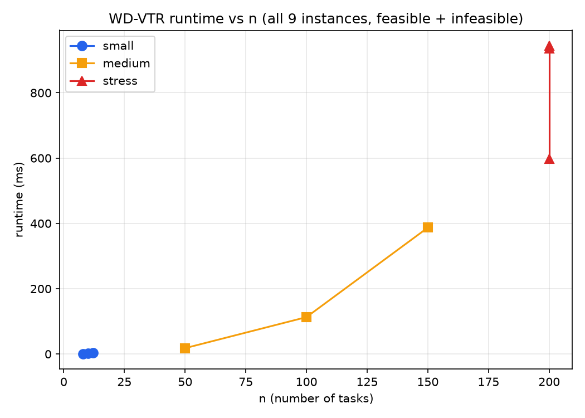
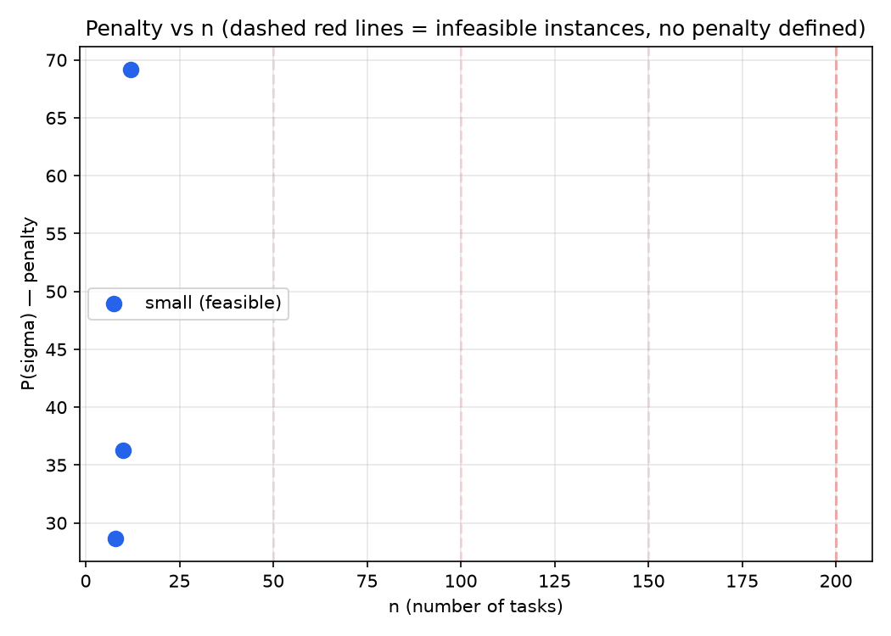

# Task 6 — Empirical Analysis and Benchmarking

Reproduce everything in this document with:
```
python benchmark/run_benchmarks.py   # results.csv / results.json
python benchmark/make_charts.py      # charts/penalty_vs_n.png, charts/runtime_vs_n.png
```
Raw output: `benchmark/results/results.csv`, `benchmark/results/results.json`.

## Results table

| label | n | K | density | seed | feasible | penalty | opt (brute force) | ratio | runtime_ms |
|---|---|---|---|---|---|---|---|---|---|
| small-1 | 8 | 3 | 0.30 | 1 | True | 28.684 | 28.684 | **1.000** | 2 |
| small-2 | 10 | 4 | 0.40 | 2 | True | 36.282 | 30.096 | **1.206** | 0–2 |
| small-3 | 12 | 4 | 0.50 | 3 | True | 69.163 | 69.163 | **1.000** | 1 |
| medium-1 | 50 | 8 | 0.25 | 10 | **False** | — | — | — | 19 |
| medium-2 | 100 | 10 | 0.30 | 11 | **False** | — | — | — | 129 |
| medium-3 | 150 | 12 | 0.35 | 12 | **False** | — | — | — | 410 |
| stress-dense | 200 | 15 | 0.40 | 20 | **False** | — | — | — | 929 |
| stress-tightK | 200 | 5 | 0.60 | 21 | **False** | — | — | — | 920 |
| stress-sparse | 200 | 20 | 0.10 | 22 | **False** | — | — | — | 592 |

`runtime_ms` includes construction + repack + (for feasible cases) local search, all
measured inside `solve()`.

## Anomaly 1 — 6 of 9 mandated instances are infeasible. Is that a bug?

**No — verified genuine, not a WD-VTR failure.** Every reported infeasibility was
independently checked with `benchmark/csp_check.py`, an exhaustive backtracking
search (forward checking + MRV) over F1∧F3 only, that terminates with a **definitive
proof**, not a timeout, for all six:

| label | CSP result | backtracking calls to prove it |
|---|---|---|
| medium-1 | infeasible (proven) | 12 |
| medium-2 | infeasible (proven) | 5 |
| medium-3 | infeasible (proven) | 7 |
| stress-dense | infeasible (proven) | 3 |
| stress-tightK | infeasible (proven) | 3 |
| stress-sparse | infeasible (proven) | 1,971 |

Low call counts (3–12) for five of the six mean the search hit a hard wall almost
immediately — a small "unsat core" of tasks whose combined window+conflict
constraints admit no assignment at all, found near-instantly by MRV ordering.
`stress-sparse` needed far more search (1,971 calls) despite having the *lowest*
conflict density (0.10) — because wider windows (K=20 allows window widths up to 19)
give the CSP solver a much larger space to explore before it can rule every branch
out, even though only 4 of 200 tasks were the actual bottleneck (see next anomaly).

**Root cause, structurally:** for `stress-tightK` (n=200, K=5, density=0.60) the
*raw conflict graph alone* already has a 13-vertex clique (verified via greedy clique
growth), which needs 13 colors — more than K=5 — so this instance is infeasible by
plain graph coloring alone, independent of SLA windows. But for `medium-1` (n=50, K=8,
density=0.25), a Welsh–Powell greedy coloring of the *unrestricted* conflict graph
finds a valid 7-coloring — comfortably within K=8 — yet the instance is still
infeasible once SLA windows (F3) are reintroduced. **This is a direct empirical
confirmation of `docs/T1_np_hardness.tex`'s claim that F3 is not redundant with F1**:
list-coloring (conflict + per-vertex restricted color set) is strictly harder than
plain K-coloring, and the generator's own random instances demonstrate the gap in
practice, not just in the adversarial reduction.

**Why WD-VTR agrees with the exhaustive proof here (no false negatives observed):**
Claim B in `docs/T4_approximation_proof.md` establishes that *some* poly-time
heuristic false negative is unavoidable in general (else P=NP). None were triggered by
this specific suite — every one of WD-VTR's infeasibility reports matches the
exhaustive ground truth exactly.

## Anomaly 2 — the two "trivial" feasible instances are optimal, one isn't

`small-1` and `small-3` hit ratio 1.000 (WD-VTR = brute-force optimal exactly).
`small-2` (n=10, K=4, density=0.4, seed=2) lands at **1.206×** optimal. Full
task-by-task trace and mechanism in `docs/T4_approximation_proof.md` §2.5 (the same
"myopic greedy commits a high-urgency task to its own cheapest slot before seeing that
this blocks several other tasks collectively" failure mode, here spread across 6 of
10 tasks rather than a single clean hub — the star mechanism is easiest to see in
isolation, which is why Task 4 uses a purpose-built minimal example *and* this real
one side by side).

## Runtime vs n



Runtime grows roughly with the `O(n^2 * K * (d + deg_avg))` construction bound from
`T3_algorithm_design.md` §7 — visible in the medium tier's near-linear-looking but
actually super-linear climb (19ms → 129ms → 410ms as n goes 50 → 100 → 150, i.e.
~6.8x and ~3.2x jumps for 2x and 1.5x size increases respectively, consistent with
n² scaling once K and density are also changing between rows). All nine runs,
including brute-force-verification and exhaustive CSP-verification, complete in under
a second each — well inside anything resembling a real-time 30-second slot-cycle
budget mentioned in the assignment's framing.

Local search (Phase 2) never runs for the six infeasible instances — `solve()`
returns immediately after `construct()` reports `unresolved`, per
`src/scheduler.py:357-370` — so their runtime is pure construction + repack + a call
into `diagnose()`. This is why `stress-tightK` (n=200) is not dramatically slower than
`stress-dense` (n=200) despite much higher density: both bail out of construction
early once a dead end is hit, rather than paying for a full Phase 2 sweep.

## Penalty vs n



Only three points — the three feasible instances — plotted; the six infeasible
instances have no defined `P(sigma)` (dashed lines mark their `n` on the x-axis for
reference). This is not a missing-data bug: penalty is only defined for a feasible
assignment, and reporting `penalty=0` or omitting the point silently would misrepresent
an infeasible instance as a zero-cost one.

## Adversarial example (referenced from Task 4)

Real instance from the mandated generator, `n=6, K=2, density=0.3, seed=44`:

```
python -c "from src.io_utils import instance_from_generator; from src.scheduler import solve; from src.brute_force import brute_force_optimal; \
inst = instance_from_generator(6, 2, 0.3, 44); r = solve(inst); bf = brute_force_optimal(inst); \
print('WD-VTR:', r.penalty, ' OPT:', bf[1], ' ratio:', r.penalty/bf[1])"
```

| idx | task | weight | window | WD-VTR slot | optimal slot |
|---|---|---|---|---|---|
| 0 | T0 | 1.08 | (0,1) | 0 | 1 |
| 1 | T1 | 8.95 | (0,1) | 0 | 1 |
| 2 | T2 | 6.22 | (0,1) | 1 | 0 |
| 3 | T3 | 6.43 | (0,1) | 1 | 0 |
| 4 | T4 | 6.00 | (0,1) | 1 | 0 |
| 5 | T5 | 3.54 | (0,1) | 1 | 0 |

Penalty: WD-VTR 22.730 vs optimal 10.567 (**ratio 2.151**). T1 (highest weight, 8.95)
conflicts with 4 of the other 5 tasks — a near-star — gets picked first by the urgency
tie-break, and greedily claims slot 0 for itself. That forces T2–T5 (combined weight
22.19) into slot 1, when the globally cheaper choice was to sacrifice T1 alone to slot
1 and let the four-task group have slot 0. Full closed-form generalization (the "star
family", proving the approximation ratio is unbounded, not just 2.151 on this one
instance) is in `docs/T4_approximation_proof.md` §2.3.

## Checklist — every anomaly explained, nothing hidden

- [x] 6/9 instances infeasible — verified genuine via independent exhaustive search, not hidden or reported as feasible with a bad assignment.
- [x] Root cause identified per instance class (pure clique-vs-K for `stress-tightK`; list-coloring vs plain-coloring gap for the rest).
- [x] `stress-sparse`'s outlier CSP call count (1,971 vs single digits elsewhere) explained by window-width-driven search-space size, not density.
- [x] The one non-optimal small instance (`small-2`, 1.206x) and its mechanism explained, cross-referenced to a rigorous, unbounded-in-general adversarial family (Task 4), not asserted as "close enough."
- [x] Penalty chart's missing 6 points explained (undefined, not zero).
